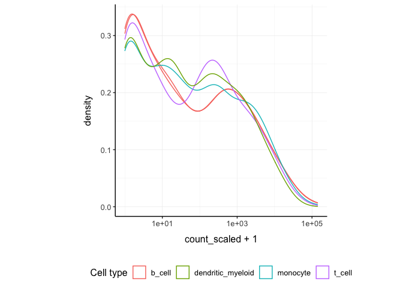
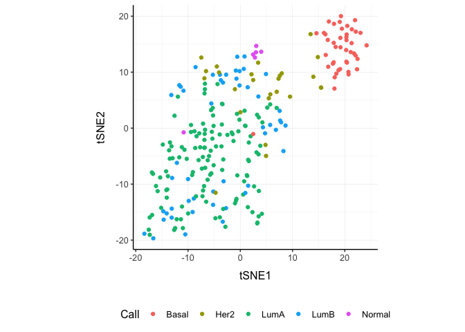
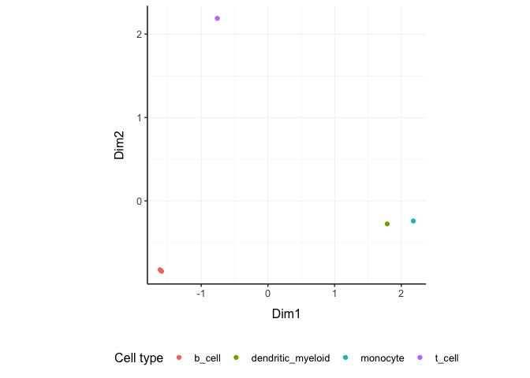
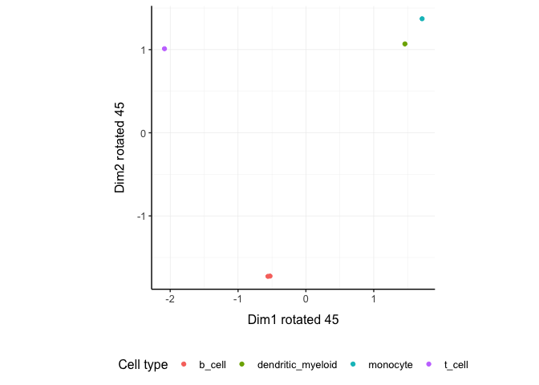
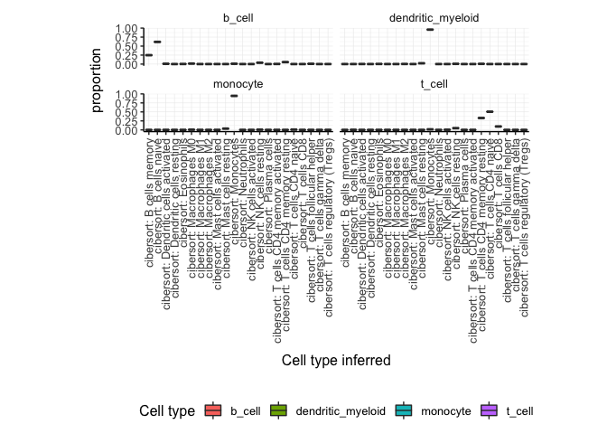
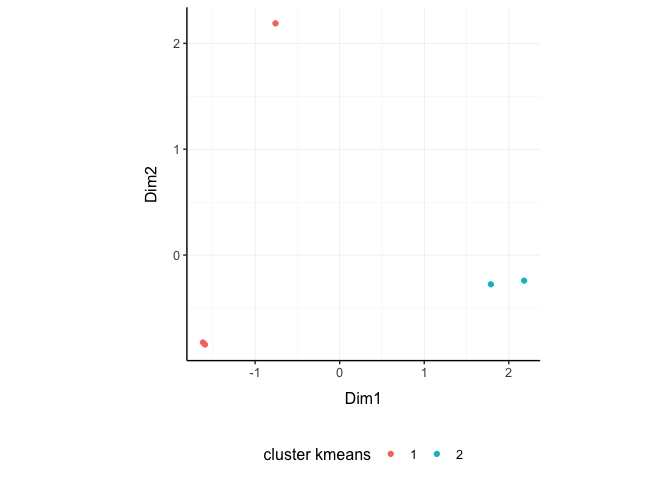
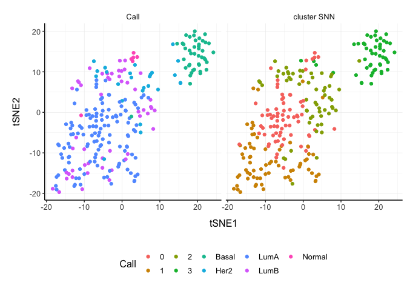

tidybulk - part of tidyTranscriptomics
================

<!-- badges: start -->

<!-- badges: end -->

**Brings transcriptomics to the tidyverse!** (SEO: tidy differential
expression)

========================================================

website:
[stemangiola.github.io/tidybulk/](http://stemangiola.github.io/tidybulk/)

Please have a look also to

-   [tidyseurat](https://github.com/stemangiola/tidyseurat) for tidy
    high-level data analysis and manipulation
-   [nanny](https://github.com/stemangiola/nanny) for tidy high-level
    data analysis and manipulation
-   [tidygate](https://github.com/stemangiola/tidygate) for adding
    custom gate information to your tibble
-   [tidyHeatmap](https://github.com/stemangiola/tidyHeatmap) for
    heatmaps produced with tidy principles

Introduction
============

Tidybulk enables analysis of RNA sequencing data following the tidy data
paradigm.

**IMPORTANT!** From version 1.1.6, the detection of abundant/lowly
abundant transcripts has to be done explicitly
(**identify\_abundant()**; you will be warned otherwise). This because,
it is better to make each function do one thing only, without
hidden/implicit procedures (as stated in the tidy data manifesto). This
improves logical flow, and software modularity.

Functions/utilities available
-----------------------------

| Function                        | Description                                                                  |
|---------------------------------|------------------------------------------------------------------------------|
| `identify_abundant`             | identify the abundant genes                                                  |
| `aggregate_duplicates`          | Aggregate abundance and annotation of duplicated transcripts in a robust way |
| `scale_abundance`               | Scale (normalise) abundance for RNA sequencing depth                         |
| `reduce_dimensions`             | Perform dimensionality reduction (PCA, MDS, tSNE)                            |
| `cluster_elements`              | Labels elements with cluster identity (kmeans, SNN)                          |
| `remove_redundancy`             | Filter out elements with highly correlated features                          |
| `adjust_abundance`              | Remove known unwanted variation (Combat)                                     |
| `test_differential_abundance`   | Differential transcript abundance testing (DE)                               |
| `deconvolve_cellularity`        | Estimated tissue composition (Cibersort or llsr)                             |
| `test_differential_cellularity` | Differential cell-type abundance testing                                     |
| `keep_variable`                 | Filter for top variable features                                             |
| `keep_abundant`                 | Filter out lowly abundant transcripts                                        |
| `test_gene_enrichment`          | Gene enrichment analyses (EGSEA)                                             |
| `test_gene_overrepresentation`  | Gene enrichment on list of transcript names (no rank)                        |

| Utilities                  | Description                                                     |
|----------------------------|-----------------------------------------------------------------|
| `get_bibliography`         | Get the bibliography of your workflow                           |
| `tidybulk`                 | add tidybulk attributes to a tibble object                      |
| `tidybulk_SAM_BAM`         | Convert SAM BAM files into tidybulk tibble                      |
| `pivot_sample`             | Select sample-wise columns/information                          |
| `pivot_transcript`         | Select transcript-wise columns/information                      |
| `rotate_dimensions`        | Rotate two dimensions of a degree                               |
| `ensembl_to_symbol`        | Add gene symbol from ensembl IDs                                |
| `symbol_to_entrez`         | Add entrez ID from gene symbol                                  |
| `describe_transcript`      | Add gene description from gene symbol                           |
| `impute_missing_abundance` | Impute abundance for missing data points using sample groupings |
| `fill_missing_abundance`   | Fill abundance for missing data points using an arbitrary value |

Minimal input data frame
------------------------

| sample          | transcript      | abundance | annotation |
|-----------------|-----------------|-----------|------------|
| `chr` or `fctr` | `chr` or `fctr` | `integer` | …          |

Output data frame
-----------------

| sample          | transcript      | abundance | annotation | new information |
|-----------------|-----------------|-----------|------------|-----------------|
| `chr` or `fctr` | `chr` or `fctr` | `integer` | …          | …               |

Create `tidybulk` tibble. It memorises key column names
-------------------------------------------------------

    tt = counts_mini %>% tidybulk(sample, transcript, count)

**All tidybulk methods are directly compatible with SummarizedExperiment
as well.**

Aggregate `transcripts`
-----------------------

tidybulk provide the `aggregate_duplicates` function to aggregate
duplicated transcripts (e.g., isoforms, ensembl). For example, we often
have to convert ensembl symbols to gene/transcript symbol, but in doing
so we have to deal with duplicates. `aggregate_duplicates` takes a
tibble and column names (as symbols; for `sample`, `transcript` and
`count`) as arguments and returns a tibble with aggregate transcript
with the same name. All the rest of the column are appended, and factors
and boolean are appended as characters.

    tt.aggr =  tt %>% aggregate_duplicates(     aggregation_function = sum )

    tt.aggr

    ## # A tibble: 2,635 x 7
    ##    sample     transcript `Cell type` count time  condition `merged transcripts`
    ##    <chr>      <chr>      <chr>       <dbl> <chr> <chr>                    <dbl>
    ##  1 SRR1740034 TNFRSF4    b_cell          6 0 d   TRUE                         1
    ##  2 SRR1740034 PLCH2      b_cell        926 0 d   TRUE                         1
    ##  3 SRR1740034 PADI4      b_cell         21 0 d   TRUE                         1
    ##  4 SRR1740034 PAX7       b_cell          0 0 d   TRUE                         1
    ##  5 SRR1740034 CDA        b_cell          1 0 d   TRUE                         1
    ##  6 SRR1740034 RCAN3      b_cell        905 0 d   TRUE                         1
    ##  7 SRR1740034 SMPDL3B    b_cell          3 0 d   TRUE                         1
    ##  8 SRR1740034 EPB41      b_cell       4667 0 d   TRUE                         1
    ##  9 SRR1740034 LCK        b_cell        436 0 d   TRUE                         1
    ## 10 SRR1740034 COL8A2     b_cell          1 0 d   TRUE                         1
    ## # … with 2,625 more rows

All functions are also directly compatible with `SummarizedExperiment`.

    se.aggr =  se_mini %>% aggregate_duplicates(    aggregation_function = sum )

    se.aggr

    ## class: SummarizedExperiment 
    ## dim: 527 5 
    ## metadata(0):
    ## assays(1): count
    ## rownames(527): ABCB4 ABCB9 ... ZNF324 ZNF442
    ## rowData names(0):
    ## colnames(5): SRR1740034 SRR1740035 SRR1740043 SRR1740058 SRR1740067
    ## colData names(4): Cell.type time condition merged.transcripts

Scale `counts`
--------------

We may want to compensate for sequencing depth, scaling the transcript
abundance (e.g., with TMM algorithm, Robinson and Oshlack
doi.org/10.1186/gb-2010-11-3-r25). `scale_abundance` takes a tibble,
column names (as symbols; for `sample`, `transcript` and `count`) and a
method as arguments and returns a tibble with additional columns with
scaled data as `<NAME OF COUNT COLUMN>_scaled`.

    tt.norm =  tt.aggr %>% identify_abundant(factor_of_interest = condition) %>% scale_abundance(method="TMM")

    tt.norm %>% select(`count`, count_scaled, .abundant, everything())

    ## # A tibble: 2,635 x 11
    ##    count count_scaled .abundant sample transcript `Cell type` time  condition
    ##    <dbl>        <dbl> <lgl>     <chr>  <chr>      <chr>       <chr> <chr>    
    ##  1     6         6.66 FALSE     SRR17… TNFRSF4    b_cell      0 d   TRUE     
    ##  2   926      1028.   TRUE      SRR17… PLCH2      b_cell      0 d   TRUE     
    ##  3    21        23.3  TRUE      SRR17… PADI4      b_cell      0 d   TRUE     
    ##  4     0         0    FALSE     SRR17… PAX7       b_cell      0 d   TRUE     
    ##  5     1         1.11 TRUE      SRR17… CDA        b_cell      0 d   TRUE     
    ##  6   905      1004.   TRUE      SRR17… RCAN3      b_cell      0 d   TRUE     
    ##  7     3         3.33 FALSE     SRR17… SMPDL3B    b_cell      0 d   TRUE     
    ##  8  4667      5179.   TRUE      SRR17… EPB41      b_cell      0 d   TRUE     
    ##  9   436       484.   TRUE      SRR17… LCK        b_cell      0 d   TRUE     
    ## 10     1         1.11 TRUE      SRR17… COL8A2     b_cell      0 d   TRUE     
    ## # … with 2,625 more rows, and 3 more variables: `merged transcripts` <dbl>,
    ## #   TMM <dbl>, multiplier <dbl>

We can easily plot the scaled density to check the scaling outcome. On
the x axis we have the log scaled counts, on the y axes we have the
density, data is grouped by sample and coloured by cell type.

    tt.norm %>%
        ggplot(aes(count_scaled + 1, group=sample, color=`Cell type`)) +
        geom_density() +
        scale_x_log10() +
        my_theme

<!-- -->

All functions are also directly compatible with `SummarizedExperiment`.

    se.norm =  se.aggr %>% identify_abundant(factor_of_interest = condition) %>% scale_abundance(method="TMM")

    se.norm

    ## class: SummarizedExperiment 
    ## dim: 527 5 
    ## metadata(0):
    ## assays(2): count count_scaled
    ## rownames(527): ABCB4 ABCB9 ... ZNF324 ZNF442
    ## rowData names(1): .abundant
    ## colnames(5): SRR1740034 SRR1740035 SRR1740043 SRR1740058 SRR1740067
    ## colData names(6): Cell.type time ... TMM multiplier

Filter `variable transcripts`
-----------------------------

We may want to identify and filter variable transcripts.

    tt.norm.variable = tt.norm %>% keep_variable()

Reduce `dimensions`
-------------------

We may want to reduce the dimensions of our data, for example using PCA
or MDS algorithms. `reduce_dimensions` takes a tibble, column names (as
symbols; for `sample`, `transcript` and `count`) and a method (e.g., MDS
or PCA) as arguments and returns a tibble with additional columns for
the reduced dimensions.

**MDS** (Robinson et al., 10.1093/bioinformatics/btp616)

    tt.norm.MDS =  tt.norm %>% reduce_dimensions(.abundance = count_scaled, method="MDS", .dims = 3)

    tt.norm.MDS %>% select(sample, contains("Dim"), `Cell type`, time ) %>% distinct()

    ## # A tibble: 5 x 6
    ##   sample       Dim1   Dim2     Dim3 `Cell type`       time 
    ##   <chr>       <dbl>  <dbl>    <dbl> <chr>             <chr>
    ## 1 SRR1740034 -1.62  -0.826 -0.0249  b_cell            0 d  
    ## 2 SRR1740035 -1.59  -0.845 -0.0429  b_cell            1 d  
    ## 3 SRR1740043  2.18  -0.241 -0.627   monocyte          1 d  
    ## 4 SRR1740058 -0.759  2.19  -0.00659 t_cell            0 d  
    ## 5 SRR1740067  1.79  -0.276  0.702   dendritic_myeloid 1 d

On the x and y axes axis we have the reduced dimensions 1 to 3, data is
coloured by cell type.

    tt.norm.MDS %>%
        select(contains("Dim"), sample, `Cell type`) %>%
      distinct() %>%
      GGally::ggpairs(columns = 1:3, ggplot2::aes(colour=`Cell type`))

All functions are also directly compatible with `SummarizedExperiment`.

    se.norm.MDS =  se.norm %>% reduce_dimensions(.abundance = count_scaled, method="MDS", .dims = 3)

    se.norm.MDS

    ## class: SummarizedExperiment 
    ## dim: 527 5 
    ## metadata(0):
    ## assays(2): count count_scaled
    ## rownames(527): ABCB4 ABCB9 ... ZNF324 ZNF442
    ## rowData names(1): .abundant
    ## colnames(5): SRR1740034 SRR1740035 SRR1740043 SRR1740058 SRR1740067
    ## colData names(9): Cell.type time ... Dim2 Dim3

**PCA**

    tt.norm.PCA = tt.norm %>% reduce_dimensions(.abundance = count_scaled, method="PCA" ,  .dims = 3)

    tt.norm.PCA %>% select(sample, contains("PC"), `Cell type`, time ) %>% distinct()

    ## # A tibble: 5 x 6
    ##   sample        PC1    PC2     PC3 `Cell type`       time 
    ##   <chr>       <dbl>  <dbl>   <dbl> <chr>             <chr>
    ## 1 SRR1740034 -11.9  -8.41   0.0394 b_cell            0 d  
    ## 2 SRR1740035 -12.0  -8.62   0.591  b_cell            1 d  
    ## 3 SRR1740043  17.9  -0.748  7.75   monocyte          1 d  
    ## 4 SRR1740058  -9.32 18.8    0.152  t_cell            0 d  
    ## 5 SRR1740067  15.2  -0.983 -8.53   dendritic_myeloid 1 d

On the x and y axes axis we have the reduced dimensions 1 to 3, data is
coloured by cell type.

    tt.norm.PCA %>%
        select(contains("PC"), sample, `Cell type`) %>%
      distinct() %>%
      GGally::ggpairs(columns = 1:3, ggplot2::aes(colour=`Cell type`))

All functions are also directly compatible with `SummarizedExperiment`.

    se.norm.PCA = se.norm %>% reduce_dimensions(.abundance = count_scaled, method="PCA" ,  .dims = 3)

    se.norm.PCA

    ## class: SummarizedExperiment 
    ## dim: 527 5 
    ## metadata(0):
    ## assays(2): count count_scaled
    ## rownames(527): ABCB4 ABCB9 ... ZNF324 ZNF442
    ## rowData names(1): .abundant
    ## colnames(5): SRR1740034 SRR1740035 SRR1740043 SRR1740058 SRR1740067
    ## colData names(9): Cell.type time ... PC2 PC3

**tSNE**

    tt.norm.tSNE =
        tt_tcga_breast %>%
        identify_abundant() %>%
        reduce_dimensions(
            .abundance = count_scaled,
            method = "tSNE",
            top = 500,
            perplexity=10,
            pca_scale =TRUE
        )

    ## Performing PCA
    ## Read the 251 x 50 data matrix successfully!
    ## Using no_dims = 2, perplexity = 10.000000, and theta = 0.500000
    ## Computing input similarities...
    ## Building tree...
    ## Done in 0.01 seconds (sparsity = 0.182886)!
    ## Learning embedding...
    ## Iteration 50: error is 67.379965 (50 iterations in 0.03 seconds)
    ## Iteration 100: error is 67.384677 (50 iterations in 0.03 seconds)
    ## Iteration 150: error is 67.232102 (50 iterations in 0.03 seconds)
    ## Iteration 200: error is 68.702141 (50 iterations in 0.03 seconds)
    ## Iteration 250: error is 68.281352 (50 iterations in 0.03 seconds)
    ## Iteration 300: error is 1.615015 (50 iterations in 0.03 seconds)
    ## Iteration 350: error is 1.209079 (50 iterations in 0.02 seconds)
    ## Iteration 400: error is 1.170737 (50 iterations in 0.02 seconds)
    ## Iteration 450: error is 1.140378 (50 iterations in 0.02 seconds)
    ## Iteration 500: error is 1.129398 (50 iterations in 0.02 seconds)
    ## Iteration 550: error is 1.124250 (50 iterations in 0.02 seconds)
    ## Iteration 600: error is 1.118634 (50 iterations in 0.02 seconds)
    ## Iteration 650: error is 1.112117 (50 iterations in 0.02 seconds)
    ## Iteration 700: error is 1.108848 (50 iterations in 0.02 seconds)
    ## Iteration 750: error is 1.104287 (50 iterations in 0.02 seconds)
    ## Iteration 800: error is 1.100932 (50 iterations in 0.02 seconds)
    ## Iteration 850: error is 1.099888 (50 iterations in 0.02 seconds)
    ## Iteration 900: error is 1.095553 (50 iterations in 0.02 seconds)
    ## Iteration 950: error is 1.093746 (50 iterations in 0.02 seconds)
    ## Iteration 1000: error is 1.092815 (50 iterations in 0.02 seconds)
    ## Fitting performed in 0.45 seconds.

    tt.norm.tSNE %>%
        select(contains("tSNE", ignore.case = FALSE), sample, Call) %>%
        distinct()

    ## # A tibble: 251 x 4
    ##      tSNE1  tSNE2 sample                       Call 
    ##      <dbl>  <dbl> <chr>                        <fct>
    ##  1  -7.75    7.45 TCGA-A1-A0SD-01A-11R-A115-07 LumA 
    ##  2   2.05   -5.67 TCGA-A1-A0SF-01A-11R-A144-07 LumA 
    ##  3   0.915   4.03 TCGA-A1-A0SG-01A-11R-A144-07 LumA 
    ##  4  -0.145   6.41 TCGA-A1-A0SH-01A-11R-A084-07 LumA 
    ##  5  -4.61    4.67 TCGA-A1-A0SI-01A-11R-A144-07 LumB 
    ##  6   3.81    1.94 TCGA-A1-A0SJ-01A-11R-A084-07 LumA 
    ##  7  24.7   -19.4  TCGA-A1-A0SK-01A-12R-A084-07 Basal
    ##  8  12.0     8.78 TCGA-A1-A0SM-01A-11R-A084-07 LumA 
    ##  9  10.8     9.21 TCGA-A1-A0SN-01A-11R-A144-07 LumB 
    ## 10 -12.3    15.3  TCGA-A1-A0SQ-01A-21R-A144-07 LumA 
    ## # … with 241 more rows

    tt.norm.tSNE %>%
        pivot_sample() %>%
        ggplot(aes(x = `tSNE1`, y = `tSNE2`, color=Call)) + geom_point() + my_theme

<!-- -->

All functions are also directly compatible with `SummarizedExperiment`.

    se.norm.tSNE =
        se_breast_tcga_mini %>%
        identify_abundant() %>%
        reduce_dimensions(
            .abundance = count_scaled,
            method = "tSNE",
            top = 500,
            perplexity=10,
            pca_scale =TRUE
        )

    ## Performing PCA
    ## Read the 251 x 50 data matrix successfully!
    ## Using no_dims = 2, perplexity = 10.000000, and theta = 0.500000
    ## Computing input similarities...
    ## Building tree...
    ## Done in 0.01 seconds (sparsity = 0.182886)!
    ## Learning embedding...
    ## Iteration 50: error is 67.264068 (50 iterations in 0.02 seconds)
    ## Iteration 100: error is 67.093240 (50 iterations in 0.02 seconds)
    ## Iteration 150: error is 66.366601 (50 iterations in 0.02 seconds)
    ## Iteration 200: error is 67.044003 (50 iterations in 0.03 seconds)
    ## Iteration 250: error is 70.854840 (50 iterations in 0.03 seconds)
    ## Iteration 300: error is 1.606002 (50 iterations in 0.03 seconds)
    ## Iteration 350: error is 1.270206 (50 iterations in 0.03 seconds)
    ## Iteration 400: error is 1.226436 (50 iterations in 0.02 seconds)
    ## Iteration 450: error is 1.208810 (50 iterations in 0.02 seconds)
    ## Iteration 500: error is 1.197962 (50 iterations in 0.02 seconds)
    ## Iteration 550: error is 1.191607 (50 iterations in 0.02 seconds)
    ## Iteration 600: error is 1.184406 (50 iterations in 0.02 seconds)
    ## Iteration 650: error is 1.184263 (50 iterations in 0.02 seconds)
    ## Iteration 700: error is 1.139742 (50 iterations in 0.02 seconds)
    ## Iteration 750: error is 1.125021 (50 iterations in 0.02 seconds)
    ## Iteration 800: error is 1.126078 (50 iterations in 0.02 seconds)
    ## Iteration 850: error is 1.125747 (50 iterations in 0.02 seconds)
    ## Iteration 900: error is 1.124091 (50 iterations in 0.02 seconds)
    ## Iteration 950: error is 1.118300 (50 iterations in 0.02 seconds)
    ## Iteration 1000: error is 1.106711 (50 iterations in 0.02 seconds)
    ## Fitting performed in 0.42 seconds.

    se.norm.tSNE

    ## class: SummarizedExperiment 
    ## dim: 500 251 
    ## metadata(0):
    ## assays(2): count count_scaled
    ## rownames(500): ENSG00000002834 ENSG00000003989 ... ENSG00000265972
    ##   ENSG00000272398
    ## rowData names(1): .abundant
    ## colnames(251): TCGA-A1-A0SD-01A-11R-A115-07
    ##   TCGA-A1-A0SF-01A-11R-A144-07 ... TCGA-GM-A2DM-01A-11R-A180-07
    ##   TCGA-GM-A2DN-01A-11R-A180-07
    ## colData names(3): Call tSNE1 tSNE2

Rotate `dimensions`
-------------------

We may want to rotate the reduced dimensions (or any two numeric columns
really) of our data, of a set angle. `rotate_dimensions` takes a tibble,
column names (as symbols; for `sample`, `transcript` and `count`) and an
angle as arguments and returns a tibble with additional columns for the
rotated dimensions. The rotated dimensions will be added to the original
data set as `<NAME OF DIMENSION> rotated <ANGLE>` by default, or as
specified in the input arguments.

    tt.norm.MDS.rotated =
      tt.norm.MDS %>%
        rotate_dimensions(`Dim1`, `Dim2`, rotation_degrees = 45, .element = sample)

**Original** On the x and y axes axis we have the first two reduced
dimensions, data is coloured by cell type.

    tt.norm.MDS.rotated %>%
        pivot_sample() %>%
        ggplot(aes(x=`Dim1`, y=`Dim2`, color=`Cell type` )) +
      geom_point() +
      my_theme

<!-- -->

**Rotated** On the x and y axes axis we have the first two reduced
dimensions rotated of 45 degrees, data is coloured by cell type.

    tt.norm.MDS.rotated %>%
        pivot_sample() %>%
        ggplot(aes(x=`Dim1 rotated 45`, y=`Dim2 rotated 45`, color=`Cell type` )) +
      geom_point() +
      my_theme

<!-- -->

All functions are also directly compatible with `SummarizedExperiment`.

    se.norm.MDS %>%
    rotate_dimensions(`Dim1`, `Dim2`, rotation_degrees = 45, .element = sample)

    ## class: SummarizedExperiment 
    ## dim: 527 5 
    ## metadata(0):
    ## assays(2): count count_scaled
    ## rownames(527): ABCB4 ABCB9 ... ZNF324 ZNF442
    ## rowData names(1): .abundant
    ## colnames(5): SRR1740034 SRR1740035 SRR1740043 SRR1740058 SRR1740067
    ## colData names(11): Cell.type time ... Dim1.rotated.45 Dim2.rotated.45

Test `differential abundance`
-----------------------------

We may want to test for differential transcription between sample-wise
factors of interest (e.g., with edgeR). `test_differential_abundance`
takes a tibble, column names (as symbols; for `sample`, `transcript` and
`count`) and a formula representing the desired linear model as
arguments and returns a tibble with additional columns for the
statistics from the hypothesis test (e.g., log fold change, p-value and
false discovery rate).

    tt %>% identify_abundant(factor_of_interest = condition) %>%    test_differential_abundance(  ~ condition,  action="only")

    ## # A tibble: 393 x 7
    ##    transcript  logFC logCPM     F   PValue    FDR significant
    ##    <chr>       <dbl>  <dbl> <dbl>    <dbl>  <dbl> <lgl>      
    ##  1 CLEC7A     -11.6   12.7  109.  0.000142 0.0170 TRUE       
    ##  2 HK3        -12.2   13.5   90.1 0.000225 0.0170 TRUE       
    ##  3 APOBEC3A    -8.93  11.1   77.7 0.000319 0.0170 TRUE       
    ##  4 IGSF6       -7.78  10.5   71.8 0.000385 0.0170 TRUE       
    ##  5 RASSF4      -8.38  12.4   69.0 0.000422 0.0170 TRUE       
    ##  6 IL2RA        8.37   9.18  65.5 0.000477 0.0170 TRUE       
    ##  7 TLR8        -9.94  11.6   64.3 0.000497 0.0170 TRUE       
    ##  8 C5AR1       -9.97  12.2   56.7 0.000667 0.0170 TRUE       
    ##  9 FCN1       -12.6   15.4   56.6 0.000670 0.0170 TRUE       
    ## 10 CCR7         8.35  11.9   56.0 0.000687 0.0170 TRUE       
    ## # … with 383 more rows

All functions are also directly compatible with `SummarizedExperiment`.

    se_mini %>% test_differential_abundance(  ~ condition)

    ## class: SummarizedExperiment 
    ## dim: 527 5 
    ## metadata(0):
    ## assays(1): count
    ## rownames(527): ABCB4 ABCB9 ... ZNF324 ZNF442
    ## rowData names(6): logFC logCPM ... FDR significant
    ## colnames(5): SRR1740034 SRR1740035 SRR1740043 SRR1740058 SRR1740067
    ## colData names(3): Cell.type time condition

Adjust `counts`
---------------

We may want to adjust `counts` for (known) unwanted variation.
`adjust_abundance` takes as arguments a tibble, column names (as
symbols; for `sample`, `transcript` and `count`) and a formula
representing the desired linear model where the first covariate is the
factor of interest and the second covariate is the unwanted variation,
and returns a tibble with additional columns for the adjusted counts as
`<COUNT COLUMN>_adjusted`. At the moment just an unwanted covariated is
allowed at a time.

    tt.norm.adj =
        tt.norm.batch %>%
          adjust_abundance(
            ~ factor_of_interest + batch,
            .abundance = count_scaled,
            action = "only"
          )

    tt.norm.adj

    ## # A tibble: 1,965 x 3
    ##    transcript sample     count_scaled_adjusted
    ##    <chr>      <chr>                      <int>
    ##  1 ABCB4      SRR1740034                  1706
    ##  2 ABCB9      SRR1740034                    71
    ##  3 ACAP1      SRR1740034                  8678
    ##  4 ACP5       SRR1740034                  2362
    ##  5 ADAM28     SRR1740034                  7696
    ##  6 ADAMDEC1   SRR1740034                    42
    ##  7 ADRB2      SRR1740034                   414
    ##  8 AIF1       SRR1740034                     4
    ##  9 AIM2       SRR1740034                  2430
    ## 10 ALOX15     SRR1740034                    40
    ## # … with 1,955 more rows

All functions are also directly compatible with `SummarizedExperiment`.

    se.norm.batch %>%
      adjust_abundance(
        ~ factor_of_interest + batch,
        .abundance = count_scaled
      )

    ## class: SummarizedExperiment 
    ## dim: 8513 48 
    ## metadata(0):
    ## assays(3): count count_scaled count_scaled_adjusted
    ## rownames(8513): A1BG A1BG-AS1 ... ZZEF1 ZZZ3
    ## rowData names(0):
    ## colnames(48): SRR1740034 SRR1740035 ... SRR1740088 SRR1740089
    ## colData names(7): Cell.type time ... TMM multiplier

Deconvolve `Cell type composition`
----------------------------------

We may want to infer the cell type composition of our samples (with the
algorithm Cibersort; Newman et al., 10.1038/nmeth.3337).
`deconvolve_cellularity` takes as arguments a tibble, column names (as
symbols; for `sample`, `transcript` and `count`) and returns a tibble
with additional columns for the adjusted cell type proportions.

**columns truncated**

    tt.cibersort =
        tt %>%
        deconvolve_cellularity(action="get", cores=1)

    tt.cibersort %>% select(sample, contains("cibersort:")) 

    ## # A tibble: 5 x 23
    ##   sample `cibersort: B cells naive` `cibersort: B cells memory`
    ##   <chr>                       <dbl>                       <dbl>
    ## 1 SRR17…                    0.622                         0.238
    ## 2 SRR17…                    0.611                         0.257
    ## 3 SRR17…                    0                             0    
    ## 4 SRR17…                    0.00232                       0    
    ## 5 SRR17…                    0                             0    
    ## # … with 20 more variables: `cibersort: Plasma cells` <dbl>, `cibersort: T
    ## #   cells CD8` <dbl>, `cibersort: T cells CD4 naive` <dbl>, `cibersort: T cells
    ## #   CD4 memory resting` <dbl>, `cibersort: T cells CD4 memory activated` <dbl>,
    ## #   `cibersort: T cells follicular helper` <dbl>, `cibersort: T cells
    ## #   regulatory (Tregs)` <dbl>, `cibersort: T cells gamma delta` <dbl>,
    ## #   `cibersort: NK cells resting` <dbl>, `cibersort: NK cells activated` <dbl>,
    ## #   `cibersort: Monocytes` <dbl>, `cibersort: Macrophages M0` <dbl>,
    ## #   `cibersort: Macrophages M1` <dbl>, `cibersort: Macrophages M2` <dbl>,
    ## #   `cibersort: Dendritic cells resting` <dbl>, `cibersort: Dendritic cells
    ## #   activated` <dbl>, `cibersort: Mast cells resting` <dbl>, `cibersort: Mast
    ## #   cells activated` <dbl>, `cibersort: Eosinophils` <dbl>, `cibersort:
    ## #   Neutrophils` <dbl>

With the new annotated data frame, we can plot the distributions of cell
types across samples, and compare them with the nominal cell type labels
to check for the purity of isolation. On the x axis we have the cell
types inferred by Cibersort, on the y axis we have the inferred
proportions. The data is facetted and coloured by nominal cell types
(annotation given by the researcher after FACS sorting).

    tt.cibersort %>%
        gather(`Cell type inferred`, `proportion`, 5:26) %>%
      distinct(sample, `Cell type`, `Cell type inferred`, proportion) %>%
      ggplot(aes(x=`Cell type inferred`, y=proportion, fill=`Cell type`)) +
      geom_boxplot() +
      facet_wrap(~`Cell type`) +
      my_theme +
      theme(axis.text.x = element_text(angle = 90, hjust = 1, vjust = 0.5), aspect.ratio=1/5)

<!-- -->

All functions are also directly compatible with `SummarizedExperiment`.

    se.cibersort %>% deconvolve_cellularity(cores=1)

    ## class: SummarizedExperiment 
    ## dim: 8513 48 
    ## metadata(0):
    ## assays(1): count
    ## rownames(8513): A1BG A1BG-AS1 ... ZZEF1 ZZZ3
    ## rowData names(0):
    ## colnames(48): SRR1740034 SRR1740035 ... SRR1740088 SRR1740089
    ## colData names(27): Cell.type time ... cibersort..Eosinophils
    ##   cibersort..Neutrophils

Cluster `samples`
-----------------

We may want to cluster our data (e.g., using k-means sample-wise).
`cluster_elements` takes as arguments a tibble, column names (as
symbols; for `sample`, `transcript` and `count`) and returns a tibble
with additional columns for the cluster annotation. At the moment only
k-means clustering is supported, the plan is to introduce more
clustering methods.

**k-means**

    tt.norm.cluster = tt.norm %>%
      cluster_elements(.abundance = count_scaled, method="kmeans",  centers = 2 )

    tt.norm.cluster

    ## # A tibble: 2,635 x 12
    ##    sample transcript `Cell type` count time  condition `merged transcripts`
    ##    <chr>  <chr>      <chr>       <dbl> <chr> <chr>                    <dbl>
    ##  1 SRR17… TNFRSF4    b_cell          6 0 d   TRUE                         1
    ##  2 SRR17… PLCH2      b_cell        926 0 d   TRUE                         1
    ##  3 SRR17… PADI4      b_cell         21 0 d   TRUE                         1
    ##  4 SRR17… PAX7       b_cell          0 0 d   TRUE                         1
    ##  5 SRR17… CDA        b_cell          1 0 d   TRUE                         1
    ##  6 SRR17… RCAN3      b_cell        905 0 d   TRUE                         1
    ##  7 SRR17… SMPDL3B    b_cell          3 0 d   TRUE                         1
    ##  8 SRR17… EPB41      b_cell       4667 0 d   TRUE                         1
    ##  9 SRR17… LCK        b_cell        436 0 d   TRUE                         1
    ## 10 SRR17… COL8A2     b_cell          1 0 d   TRUE                         1
    ## # … with 2,625 more rows, and 5 more variables: .abundant <lgl>, TMM <dbl>,
    ## #   multiplier <dbl>, count_scaled <dbl>, `cluster kmeans` <fct>

We can add cluster annotation to the MDS dimesion reduced data set and
plot.

     tt.norm.MDS %>%
      cluster_elements(
        .abundance = count_scaled,
        method="kmeans",
        centers = 2,
        action="get"
      ) %>%
        ggplot(aes(x=`Dim1`, y=`Dim2`, color=`cluster kmeans`)) +
      geom_point() +
      my_theme

<!-- -->

All functions are also directly compatible with `SummarizedExperiment`.

    se.norm %>%
      cluster_elements(.abundance = count_scaled, method="kmeans",  centers = 2 )

    ## class: SummarizedExperiment 
    ## dim: 527 5 
    ## metadata(0):
    ## assays(2): count count_scaled
    ## rownames(527): ABCB4 ABCB9 ... ZNF324 ZNF442
    ## rowData names(1): .abundant
    ## colnames(5): SRR1740034 SRR1740035 SRR1740043 SRR1740058 SRR1740067
    ## colData names(7): Cell.type time ... multiplier cluster.kmeans

**SNN**

    tt.norm.SNN =   tt.norm.tSNE %>%    cluster_elements(.abundance= count_scaled, method = "SNN")

    ## Modularity Optimizer version 1.3.0 by Ludo Waltman and Nees Jan van Eck
    ## 
    ## Number of nodes: 251
    ## Number of edges: 8500
    ## 
    ## Running Louvain algorithm...
    ## Maximum modularity in 10 random starts: 0.5277
    ## Number of communities: 4
    ## Elapsed time: 0 seconds

    tt.norm.SNN %>%
        pivot_sample()

    ## # A tibble: 251 x 5
    ##    sample                       Call    tSNE1  tSNE2 `cluster SNN`
    ##    <chr>                        <fct>   <dbl>  <dbl> <fct>        
    ##  1 TCGA-A1-A0SD-01A-11R-A115-07 LumA   -7.75    7.45 1            
    ##  2 TCGA-A1-A0SF-01A-11R-A144-07 LumA    2.05   -5.67 2            
    ##  3 TCGA-A1-A0SG-01A-11R-A144-07 LumA    0.915   4.03 1            
    ##  4 TCGA-A1-A0SH-01A-11R-A084-07 LumA   -0.145   6.41 0            
    ##  5 TCGA-A1-A0SI-01A-11R-A144-07 LumB   -4.61    4.67 0            
    ##  6 TCGA-A1-A0SJ-01A-11R-A084-07 LumA    3.81    1.94 1            
    ##  7 TCGA-A1-A0SK-01A-12R-A084-07 Basal  24.7   -19.4  3            
    ##  8 TCGA-A1-A0SM-01A-11R-A084-07 LumA   12.0     8.78 2            
    ##  9 TCGA-A1-A0SN-01A-11R-A144-07 LumB   10.8     9.21 2            
    ## 10 TCGA-A1-A0SQ-01A-21R-A144-07 LumA  -12.3    15.3  1            
    ## # … with 241 more rows

    tt.norm.SNN %>%
        select(contains("tSNE", ignore.case = FALSE), `cluster SNN`, sample, Call) %>%
        gather(source, Call, c("cluster SNN", "Call")) %>%
        distinct() %>%
        ggplot(aes(x = `tSNE1`, y = `tSNE2`, color=Call)) + geom_point() + facet_grid(~source) + my_theme

<!-- -->

    # Do differential transcription between clusters
    tt.norm.SNN %>%
        mutate(factor_of_interest = `cluster SNN` == 3) %>%
        test_differential_abundance(
        ~ factor_of_interest,
        action="only"
       )

    ## # A tibble: 488 x 7
    ##    ens             logFC logCPM     F   PValue      FDR significant
    ##    <chr>           <dbl>  <dbl> <dbl>    <dbl>    <dbl> <lgl>      
    ##  1 ENSG00000111716  2.96   9.64  395. 1.22e-53 5.96e-51 TRUE       
    ##  2 ENSG00000065978  1.59  10.2   381. 2.11e-52 5.14e-50 TRUE       
    ##  3 ENSG00000186832  6.25   8.04  354. 4.93e-50 8.02e-48 TRUE       
    ##  4 ENSG00000140545  2.69   9.53  343. 5.61e-49 6.85e-47 TRUE       
    ##  5 ENSG00000181617  7.98   9.13  307. 1.39e-45 1.36e-43 TRUE       
    ##  6 ENSG00000137673  3.89   8.26  273. 4.00e-42 3.25e-40 TRUE       
    ##  7 ENSG00000143947  1.02  10.7   255. 3.95e-40 2.76e-38 TRUE       
    ##  8 ENSG00000124107  4.66   8.61  240. 1.55e-38 9.47e-37 TRUE       
    ##  9 ENSG00000092621  2.92   8.40  233. 9.35e-38 5.07e-36 TRUE       
    ## 10 ENSG00000083444  1.37   9.40  232. 1.25e-37 6.08e-36 TRUE       
    ## # … with 478 more rows

All functions are also directly compatible with `SummarizedExperiment`.

    se.norm.tSNE %>%    cluster_elements(.abundance= count_scaled, method = "SNN")

    ## Modularity Optimizer version 1.3.0 by Ludo Waltman and Nees Jan van Eck
    ## 
    ## Number of nodes: 251
    ## Number of edges: 8500
    ## 
    ## Running Louvain algorithm...
    ## Maximum modularity in 10 random starts: 0.5277
    ## Number of communities: 4
    ## Elapsed time: 0 seconds

    ## class: SummarizedExperiment 
    ## dim: 500 251 
    ## metadata(0):
    ## assays(2): count count_scaled
    ## rownames(500): ENSG00000002834 ENSG00000003989 ... ENSG00000265972
    ##   ENSG00000272398
    ## rowData names(1): .abundant
    ## colnames(251): TCGA-A1-A0SD-01A-11R-A115-07
    ##   TCGA-A1-A0SF-01A-11R-A144-07 ... TCGA-GM-A2DM-01A-11R-A180-07
    ##   TCGA-GM-A2DN-01A-11R-A180-07
    ## colData names(4): Call tSNE1 tSNE2 cluster.SNN

Drop `redundant`
----------------

We may want to remove redundant elements from the original data set
(e.g., samples or transcripts), for example if we want to define
cell-type specific signatures with low sample redundancy.
`remove_redundancy` takes as arguments a tibble, column names (as
symbols; for `sample`, `transcript` and `count`) and returns a tibble
dropped recundant elements (e.g., samples). Two redundancy estimation
approaches are supported:

-   removal of highly correlated clusters of elements (keeping a
    representative) with method=“correlation”
-   removal of most proximal element pairs in a reduced dimensional
    space.

**Approach 1**

    tt.norm.non_redundant = tt.norm.MDS %>%  remove_redundancy( method = "correlation" )

We can visualise how the reduced redundancy with the reduced dimentions
look like

    tt.norm.non_redundant %>%
        pivot_sample() %>%
        ggplot(aes(x=`Dim1`, y=`Dim2`, color=`Cell type`)) +
      geom_point() +
      my_theme

<!-- -->

All functions are also directly compatible with `SummarizedExperiment`.

    se.norm.MDS %>%  remove_redundancy( method = "correlation" )

    ## class: SummarizedExperiment 
    ## dim: 527 4 
    ## metadata(0):
    ## assays(2): count count_scaled
    ## rownames(527): ABCB4 ABCB9 ... ZNF324 ZNF442
    ## rowData names(1): .abundant
    ## colnames(4): SRR1740035 SRR1740043 SRR1740058 SRR1740067
    ## colData names(9): Cell.type time ... Dim2 Dim3

**Approach 2**

    tt.norm.non_redundant =
        tt.norm.MDS %>%
      remove_redundancy(
        method = "reduced_dimensions",
        .element = sample,
        .feature = transcript,
        Dim_a_column = `Dim1`,
        Dim_b_column = `Dim2`
      )

We can visualise MDS reduced dimensions of the samples with the closest
pair removed.

    tt.norm.non_redundant %>%
        pivot_sample() %>%
        ggplot(aes(x=`Dim1`, y=`Dim2`, color=`Cell type`)) +
      geom_point() +
      my_theme

<!-- -->

All functions are also directly compatible with `SummarizedExperiment`.

    se.norm.MDS %>%
    remove_redundancy(
        method = "reduced_dimensions",
        .element = sample,
        .feature = transcript,
        Dim_a_column = `Dim1`,
        Dim_b_column = `Dim2`
    )

    ## class: SummarizedExperiment 
    ## dim: 527 3 
    ## metadata(0):
    ## assays(2): count count_scaled
    ## rownames(527): ABCB4 ABCB9 ... ZNF324 ZNF442
    ## rowData names(1): .abundant
    ## colnames(3): SRR1740035 SRR1740058 SRR1740067
    ## colData names(9): Cell.type time ... Dim2 Dim3

Other useful wrappers
---------------------

The above wrapper streamline the most common processing of bulk RNA
sequencing data. Other useful wrappers are listed above.

From BAM/SAM to tibble of gene counts
-------------------------------------

We can calculate gene counts (using FeatureCounts; Liao Y et al.,
10.1093/nar/gkz114) from a list of BAM/SAM files and format them into a
tidy structure (similar to counts).

    counts = tidybulk_SAM_BAM(
        file_names,
        genome = "hg38",
        isPairedEnd = TRUE,
        requireBothEndsMapped = TRUE,
        checkFragLength = FALSE,
        useMetaFeatures = TRUE
    )

From ensembl IDs to gene symbol IDs
-----------------------------------

We can add gene symbols from ensembl identifiers. This is useful since
different resources use ensembl IDs while others use gene symbol IDs.

    counts_ensembl %>% ensembl_to_symbol(ens)

    ## # A tibble: 119 x 8
    ##    ens   iso   `read count` sample cases_0_project… cases_0_samples… transcript
    ##    <chr> <chr>        <dbl> <chr>  <chr>            <chr>            <chr>     
    ##  1 ENSG… 13             144 TARGE… Acute Myeloid L… Primary Blood D… TSPAN6    
    ##  2 ENSG… 13              72 TARGE… Acute Myeloid L… Primary Blood D… TSPAN6    
    ##  3 ENSG… 13               0 TARGE… Acute Myeloid L… Primary Blood D… TSPAN6    
    ##  4 ENSG… 13            1099 TARGE… Acute Myeloid L… Primary Blood D… TSPAN6    
    ##  5 ENSG… 13              11 TARGE… Acute Myeloid L… Primary Blood D… TSPAN6    
    ##  6 ENSG… 13               2 TARGE… Acute Myeloid L… Primary Blood D… TSPAN6    
    ##  7 ENSG… 13               3 TARGE… Acute Myeloid L… Primary Blood D… TSPAN6    
    ##  8 ENSG… 13            2678 TARGE… Acute Myeloid L… Primary Blood D… TSPAN6    
    ##  9 ENSG… 13             751 TARGE… Acute Myeloid L… Primary Blood D… TSPAN6    
    ## 10 ENSG… 13               1 TARGE… Acute Myeloid L… Primary Blood D… TSPAN6    
    ## # … with 109 more rows, and 1 more variable: ref_genome <chr>

ADD versus GET versus ONLY modes
--------------------------------

Every function takes a tidytranscriptomics structured data as input, and
(i) with action=“add” outputs the new information joint to the original
input data frame (default), (ii) with action=“get” the new information
with the sample or transcript relative informatin depending on what the
analysis is about, or (iii) with action=“only” just the new information.
For example, from this data set

      tt.norm

    ## # A tibble: 2,635 x 11
    ##    sample transcript `Cell type` count time  condition `merged transcripts`
    ##    <chr>  <chr>      <chr>       <dbl> <chr> <chr>                    <dbl>
    ##  1 SRR17… TNFRSF4    b_cell          6 0 d   TRUE                         1
    ##  2 SRR17… PLCH2      b_cell        926 0 d   TRUE                         1
    ##  3 SRR17… PADI4      b_cell         21 0 d   TRUE                         1
    ##  4 SRR17… PAX7       b_cell          0 0 d   TRUE                         1
    ##  5 SRR17… CDA        b_cell          1 0 d   TRUE                         1
    ##  6 SRR17… RCAN3      b_cell        905 0 d   TRUE                         1
    ##  7 SRR17… SMPDL3B    b_cell          3 0 d   TRUE                         1
    ##  8 SRR17… EPB41      b_cell       4667 0 d   TRUE                         1
    ##  9 SRR17… LCK        b_cell        436 0 d   TRUE                         1
    ## 10 SRR17… COL8A2     b_cell          1 0 d   TRUE                         1
    ## # … with 2,625 more rows, and 4 more variables: .abundant <lgl>, TMM <dbl>,
    ## #   multiplier <dbl>, count_scaled <dbl>

**action=“add”** (Default) We can add the MDS dimensions to the original
data set

      tt.norm %>%
        reduce_dimensions(
            .abundance = count_scaled,
            method="MDS" ,
            .element = sample,
            .feature = transcript,
            .dims = 3,
            action="add"
        )

    ## # A tibble: 2,635 x 14
    ##    sample transcript `Cell type` count time  condition `merged transcripts`
    ##    <chr>  <chr>      <chr>       <dbl> <chr> <chr>                    <dbl>
    ##  1 SRR17… TNFRSF4    b_cell          6 0 d   TRUE                         1
    ##  2 SRR17… PLCH2      b_cell        926 0 d   TRUE                         1
    ##  3 SRR17… PADI4      b_cell         21 0 d   TRUE                         1
    ##  4 SRR17… PAX7       b_cell          0 0 d   TRUE                         1
    ##  5 SRR17… CDA        b_cell          1 0 d   TRUE                         1
    ##  6 SRR17… RCAN3      b_cell        905 0 d   TRUE                         1
    ##  7 SRR17… SMPDL3B    b_cell          3 0 d   TRUE                         1
    ##  8 SRR17… EPB41      b_cell       4667 0 d   TRUE                         1
    ##  9 SRR17… LCK        b_cell        436 0 d   TRUE                         1
    ## 10 SRR17… COL8A2     b_cell          1 0 d   TRUE                         1
    ## # … with 2,625 more rows, and 7 more variables: .abundant <lgl>, TMM <dbl>,
    ## #   multiplier <dbl>, count_scaled <dbl>, Dim1 <dbl>, Dim2 <dbl>, Dim3 <dbl>

**action=“get”** We can add the MDS dimensions to the original data set
selecting just the sample-wise column

      tt.norm %>%
        reduce_dimensions(
            .abundance = count_scaled,
            method="MDS" ,
            .element = sample,
            .feature = transcript,
            .dims = 3,
            action="get"
        )

    ## # A tibble: 5 x 10
    ##   sample `Cell type` time  condition `merged transcripts`   TMM multiplier
    ##   <chr>  <chr>       <chr> <chr>                    <dbl> <dbl>      <dbl>
    ## 1 SRR17… b_cell      0 d   TRUE                         1 0.814      1.11 
    ## 2 SRR17… b_cell      1 d   TRUE                         1 0.772      1.04 
    ## 3 SRR17… monocyte    1 d   FALSE                        1 0.929      1.34 
    ## 4 SRR17… t_cell      0 d   TRUE                         1 1.18       0.846
    ## 5 SRR17… dendritic_… 1 d   FALSE                        1 1.45       1.09 
    ## # … with 3 more variables: Dim1 <dbl>, Dim2 <dbl>, Dim3 <dbl>

**action=“only”** We can get just the MDS dimensions relative to each
sample

      tt.norm %>%
        reduce_dimensions(
            .abundance = count_scaled,
            method="MDS" ,
            .element = sample,
            .feature = transcript,
            .dims = 3,
            action="only"
        )

    ## # A tibble: 5 x 4
    ##   sample       Dim1   Dim2     Dim3
    ##   <chr>       <dbl>  <dbl>    <dbl>
    ## 1 SRR1740034 -1.62  -0.826 -0.0249 
    ## 2 SRR1740035 -1.59  -0.845 -0.0429 
    ## 3 SRR1740043  2.18  -0.241 -0.627  
    ## 4 SRR1740058 -0.759  2.19  -0.00659
    ## 5 SRR1740067  1.79  -0.276  0.702
